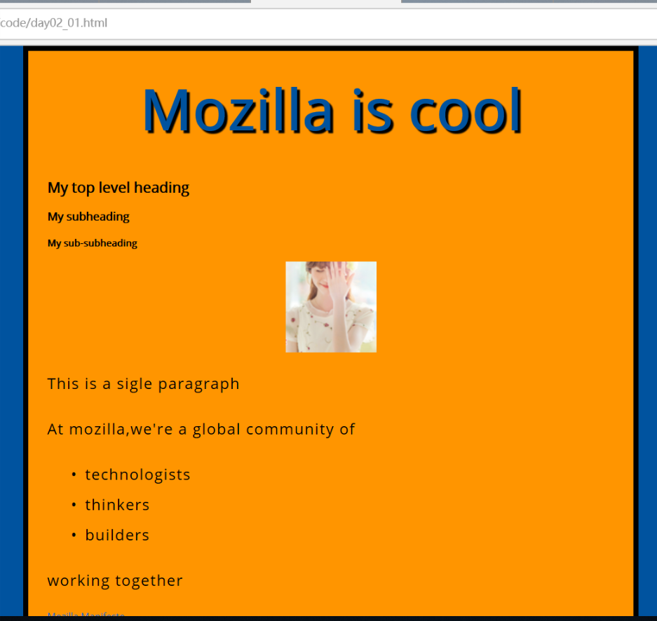

# 第一次写代码   
## 今天所犯的错误   
1. 未认真理解文档内容，文档要求增加一行代码，结果将原代码删除，替换成本应该添加的内容
2. 未区分中英文分号
3. 文件名修改后，未在代码中同步更改
4. 未区分绝对路径和相对路径，本应在同一文件夹中的两个文件，无需向上一级查找，只需同级查找
## 学到的内容
1. HTML中一个完整的元素包括：开始标签+内容+闭合标签
2. HTML的几个基本标签及用法
3. HTML嵌套元素
4. CSS的一些选择器及如何用CSS对HTML的标签内容进行样式修改
##  我的成果
